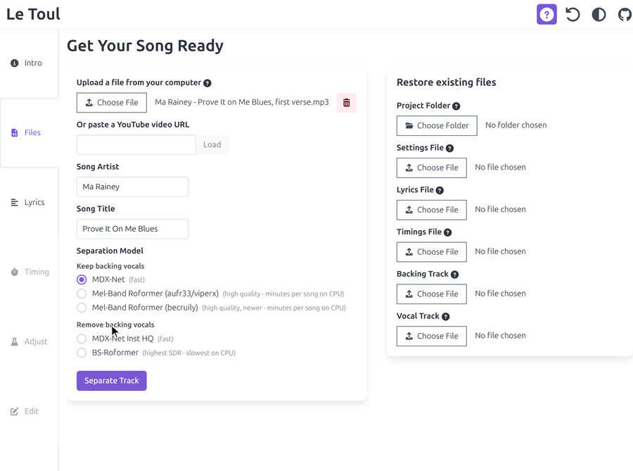
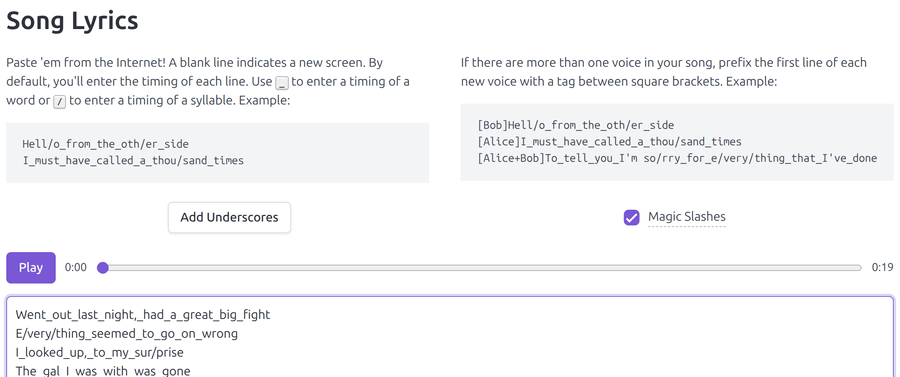
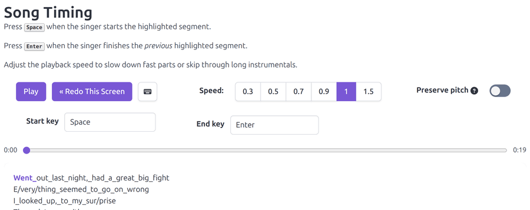
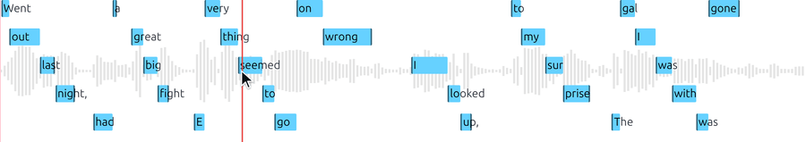
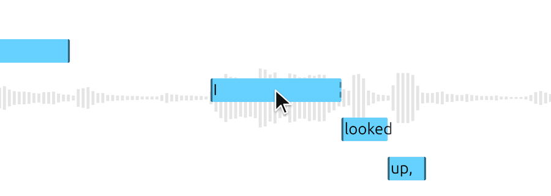
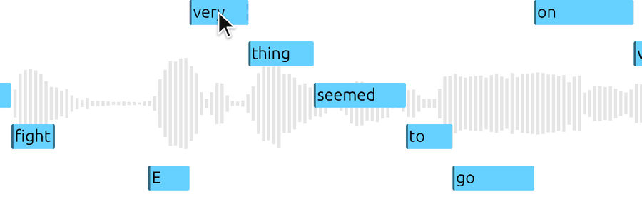
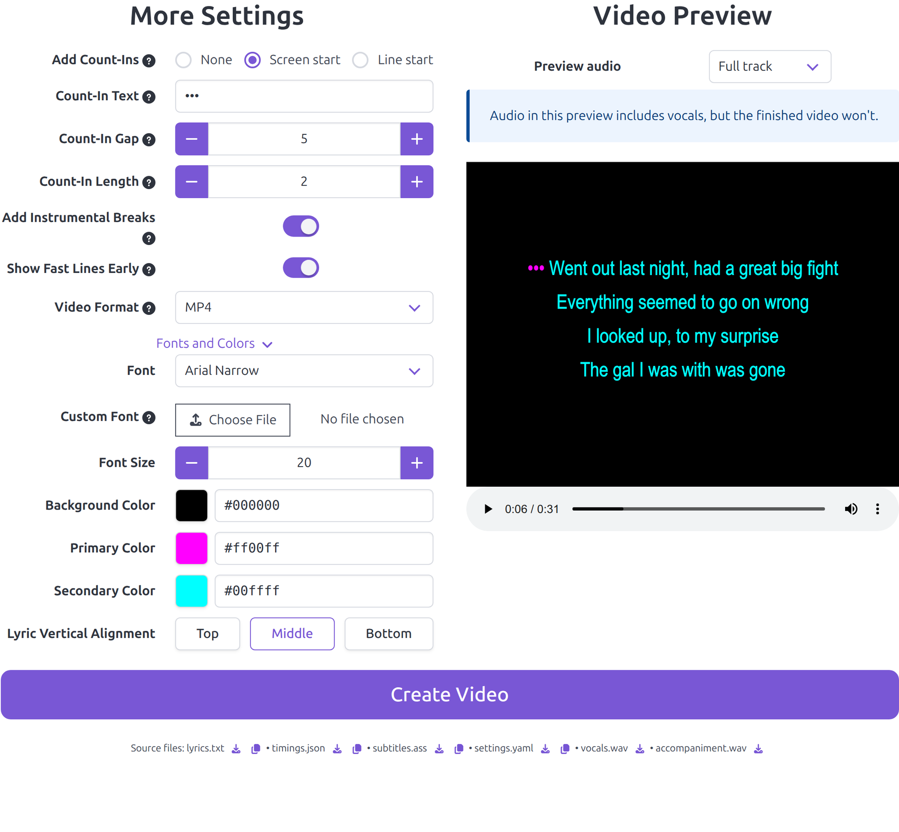
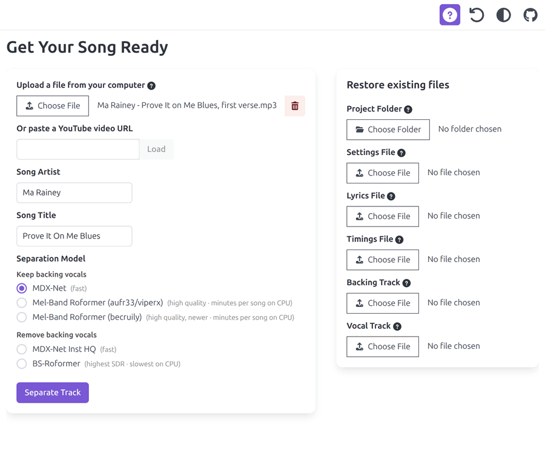

# Le Toul - An Improved Karaoke Video Maker Thing

Making a decent karaoke video can take a long time.  
You need to separate the music from the vocals, and painstakingly adjust the timing of every syllable.  
This projects lets you create videos that are 80% perfect in 20% of the time.

This is a fork of https://github.com/incidentist/the_tuul with various improvements.

## Quick start

Requirements: Docker

1. Clone the project, or download and extract the zip file if you don't have git
2. Run it with `docker compose`.
3. Open http://localhost:8080/ in your browser.

```
git clone https://github.com/vctls/le_toul.git
cd le_toul
docker compose up
```

The image builds on the first run, and the first separation downloads the selected model.
Both take a while the first time.

## What's new in this fork

### Voice separation

- **Three additional separation models**, grouped by what they do to the backing vocals:
  - _Keep them:_ MDX-Net (fast), Mel-Band Roformer (aufr33/viperx), Mel-Band Roformer (becruily).
  - _Remove them:_ MDX-Net Inst HQ (fast), BS-Roformer (highest SDR, slowest on CPU).
- The separation process shows an actual progress indicator as soon as possible.
- Separation progress also replaces the icon on the Song File tab header, so it stays visible from any other tab.
- **Cancellable jobs.** Separation runs as a background task, so the request no longer blocks, and a
  Cancel button stops a job you started by mistake instead of leaving you to wait it out.
- Already have an instrumental or an a cappella? Load them directly and skip separation.



### Lyrics

There's a player on the Lyrics tab now, so you can listen while you check the lyrics.
Only one player runs at a time across the app, and the media keys follow whichever one you last
started.

### Multiple voices

Prefix a line with a tag in square brackets and the lyrics split into independent voices, each with its own timings,
its own pass through the timing tabs, and optionally its own font, weight and colors in the rendered video.
`[Anna+Ben]` puts the line into both. Voices can overlap freely, because nothing is shared between them but the audio.



### Tapping out the timings

The keys used to tap timing region start and end can now be remapped.  
When changing playback speed, pitch preservation can now be toggled on or off.



### Adjusting timings manually

- **Zoom the waveform by scrolling**, centered on the cursor.

  

- **Join and separate segments** by dragging the end of a rectangle.
  Drag it up to the next rectangle's start to join them. Once joined, moving either side moves their shared edge.  
  This means that you don't even have to tap the timing ends if that's too difficult, you can simply set them by hand.

  

- **Select and drag multiple regions at once.** Click one, click another, and everything between
  the two moves together, clamped by the rectangles on either side. <kbd>Esc</kbd> clears it.  
  That way you can quickly fix entire timing sections.

  

- **Keyboard control throughout:** <kbd>space</kbd> plays and pauses, <kbd>←</kbd> <kbd>→</kbd> step
  the playhead by the preroll you set (<kbd>shift</kbd> for five times as long), <kbd>Home</kbd> and
  <kbd>End</kbd> jump to the edges of the visible waveform (<kbd>ctrl</kbd> for the whole song), and
  <kbd>Enter</kbd> replays from the last position you set yourself.
- **Controls for playback rate, pitch preservation, zoom level, playhead preroll, and a global shift**
  in milliseconds for when everything is late by the same amount.
- **Listen to the vocals alone** while you adjust, instead of the full mix.

### Editing the timings

- **A advanced Edit tab** for editing timings as `<MM:SS.cc>` text.
  This makes it possible to fix subtle issues, adjust timings as precisely as you want,
  or copy and paste blocks of timings which can be useful for multi-voice tracks with partial unison.


### Rendering the video

- **MKV output** carrying the vocals and the original mix as extra audio tracks, for players that support it.
- **Count-ins** before every screen, or before any line that follows a gap, with a configurable threshold and duration.
- **Custom fonts** from your own `.ttf` or `.otf` files, bundled into the exported source files.
- A preview that resizes with the window and lets you switch between the full track and the backing track.



### Picking a project back up

The session survives a refresh, so a stray reload no longer costs you an afternoon,
and a **Start Over** button discards it when you do want a clean slate.

Nothing is lost either way. The Submit tab hands you every source file: lyrics, timings, subtitles,
settings, fonts and the separated tracks.
Point the Advanced panel at that folder once extracted to restore the whole project.
Any subset works: a folder with only lyrics and timings restores those, and each file can also be
loaded on its own.



### Finding your way around

- **One toggle shows or hides the instructions** on every tab at once.
- **Each tab has its own URL fragment**: `#lyrics`, `#adjust`, `#submit`. A reload comes back to the
  tab you were on, and you can link someone straight to a step. Stepping through the tabs doesn't
  stack history entries, so Back still works.

### Layout and dark theme

The interface follows the system dark theme, waveform and timing rectangles included.  
Forms spread into columns when there's room, and collapse when there isn't.  
The render settings and preview split the space evenly and resize with the window.

Under the hood: strict TypeScript, Prettier and Ruff formatting, a lint action, unit and end-to-end
test suites, and Docker Compose stacks for dev, production and GPU-backed separation.

## Running the dev stack

The dev stack runs either on the host directly, or in Docker.

To run locally, it requires python 3.13, [poetry](http://python-poetry.org), npm and ffmpeg.
Install it on the host with `make install`.

Copy .env.example to .env and fill out the variables.
The dev compose stack needs that file, the main one runs without it.

Run it with `docker compose`:

```
docker compose -f compose.dev.yaml up
```

And open it on http://localhost:5173

Alternatively, run it directly with Poetry:

```
> make dev
```

And open it on http://localhost:8000

### Running Separate Separator App

`poetry run python -m api.separator_server`

It listens on port 8001. The app only sends work to it when `SEPARATOR_HOST` and `SEPARATOR_PORT` point at it.

To run it in a container with GPU access instead:

```
docker compose -f compose.yaml -f compose.gpu.yaml up
```

That one needs the NVIDIA container toolkit, and is untested.

## Build

To build the Docker image:

`> make build-docker`

## Credits

Original project https://github.com/incidentist/the_tuul by [Dan Kurtz](https://github.com/incidentist)

Vocal/instrumental separation is performed by [python-audio-separator](https://github.com/nomadkaraoke/python-audio-separator), which wraps a number of pretrained models
from the [Ultimate Vocal Remover](https://github.com/Anjok07/ultimatevocalremovergui) (UVR) community.
Le Toul does not redistribute the model weights. They are auto-downloaded by `audio-separator` on first use.

Models currently exposed in the UI:

- **MDX-Net** (`UVR_MDXNET_KARA_2`, `UVR-MDX-NET-Inst_HQ_3`). UVR core team ([Anjok07](https://github.com/Anjok07), [aufr33](https://github.com/aufr33))
- **Mel-Band Roformer (karaoke)**. [aufr33](https://github.com/aufr33) & [viperx](https://huggingface.co/viperx); newer variant by [becruily](https://huggingface.co/becruily)
- **BS-Roformer**. Original architecture by [lucidrains](https://github.com/lucidrains/BS-RoFormer); weights by [viperx](https://huggingface.co/viperx)

The UVR GUI is MIT-licensed and its maintainers ask third-party tools that use these models to credit UVR and the model authors.
If you use Le Toul to publish karaoke content, please pass that attribution along.
